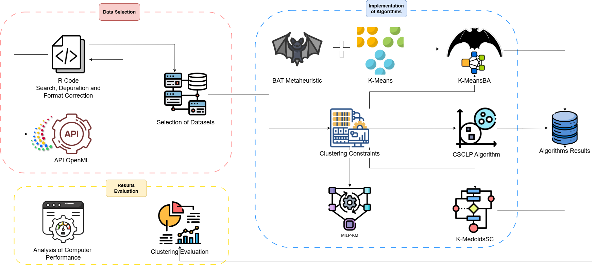

# KMeansBA

  
*Figure 1: Methodological workflow.*

## Abstract

Clustering with size constraints organizes data while respecting predefined limits on the size of each cluster. This work introduces **K-MeansBA**, a novel extension of K-Means that integrates the Bat Algorithm (BA) to strictly enforce cardinality requirements during the clustering process. Our algorithm optimizes cluster quality—measured by intra-cluster cohesion and inter-cluster separation—while guaranteeing that each cluster contains exactly the designated number of instances. We evaluated the algorithm on **100+ OpenML datasets** using internal metrics (silhouette coefficient) and external metrics (Adjusted Rand Index - ARI, Adjusted Mutual Information - AMI, and Normalized Mutual Information - NMI), alongside direct verification of constraint compliance.

Key findings include:
- **K-MeansBA reliably enforces size constraints** in all evaluated datasets.
- Competitive clustering quality, particularly in configurations with **fewer clusters**.

## Implemented Algorithms

This repository includes four cardinality-constrained clustering algorithms for comparison:

1. **K-MeansBA**: Our proposed method combining K-Means with the Bat Algorithm for size-constrained optimization.
2. **K-MedoidsSC**: A K-Medoids-based approach with size constraints.
3. **CSCLP**: A linear programming-based clustering algorithm with size constraints.
4. **MILP-KM**: A mixed integer linear programming-based clustering algorithm with size constraints.

## Repository Overview

The repository is organized around a simple workflow:

1. **`Openml.R`** downloads and filters datasets from OpenML.
2. **`Testing.R`** orchestrates the experiments and calls the four clustering algorithms.
3. Each algorithm is implemented in its own script:
   - `Bat.R`
   - `KmedoidsSC.R`
   - `CSCLP.R`
   - `MILP-KM.R`
4. The folder **`Extended Experiments`** contains experiments where the OpenML connection is removed and datasets are loaded directly from local files instead.

## Repository Structure

- **`Openml.R`**  
  Downloads, filters, validates, and stores datasets from OpenML in `odatasets_unique`.

- **`Testing.R`**  
  Main experiment driver. It loads the datasets and executes the selected clustering algorithms.

- **`Bat.R`**  
  Implementation of **K-MeansBA**.

- **`KmedoidsSC.R`**  
  Implementation of **K-MedoidsSC**.

- **`CSCLP.R`**  
  Implementation of **CSCLP**.

- **`MILP-KM.R`**  
  Implementation of **MILP-KM**.

- **`Extended Experiments/`**  
  Additional experiments using datasets loaded directly from files, without relying on OpenML.

## Requirements

Install the required R packages before running the experiments:

```r
install.packages(c(
  "cluster", "proxy", "mlr3oml", "mlr3", "pryr", "dplyr",
  "aricode", "ggplot2", "corrplot", "clValid", "RColorBrewer",
  "factoextra", "lpSolve"
))
