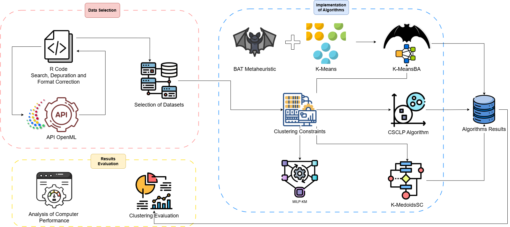

# KMeansBA

  
*Figure 1: Methodological workflow.*

## Abstract

Clustering with size constraints organizes data while respecting predefined limits on the size of each cluster. This work introduces **K-MeansBA**, a novel extension of K-Means that integrates the Bat Algorithm (BA) to strictly enforce cardinality requirements during the clustering process. Our algorithm optimizes cluster quality—measured by intra-cluster cohesion and inter-cluster separation—while guaranteeing that each cluster contains exactly the designated number of instances. We evaluated the algorithm on **100+ OpenML datasets** using internal metrics (silhouette coefficient) and external metrics (Adjusted Rand Index - ARI, Adjusted Mutual Information - AMI, and Normalized Mutual Information - NMI), alongside direct verification of constraint compliance.

Key findings include:
- **K-MeansBA reliably enforces size constraints** in all evaluated datasets.
- Competitive clustering quality, particularly in configurations with **fewer clusters**.

## Implemented Algorithms

This repository includes four cardinality-constrained clustering algorithms for comparison:

1. **K-MeansBA**: Our proposed method combining K-Means with the Bat Algorithm for size-constrained optimization.
2. **K-MedoidsSC**: A K-Medoids-based approach with size constraints.
3. **CSCLP**: A linear programming-based clustering algorithm with size constraints.
4. **MILP-KM**: A mixed integer linear programming-based clustering algorithm with size constraints.

## Repository Overview

The repository is organized around a simple workflow:

1. **`Openml.R`** downloads and filters datasets from OpenML.
2. **`Testing.R`** orchestrates the experiments and calls the four clustering algorithms.
3. Each algorithm is implemented in its own script:
   - `Bat.R`
   - `KmedoidsSC.R`
   - `CSCLP.R`
   - `MILP-KM.R`
4. The folder **`Extended Experiments`** contains experiments where the OpenML connection is removed and datasets are loaded directly from local files instead.

## Repository Structure

- **`Openml.R`**  
  Downloads, filters, validates, and stores datasets from OpenML in `odatasets_unique`.

- **`Testing.R`**  
  Main experiment driver. It loads the datasets and executes the selected clustering algorithms.

- **`Bat.R`**  
  Implementation of **K-MeansBA**.

- **`KmedoidsSC.R`**  
  Implementation of **K-MedoidsSC**.

- **`CSCLP.R`**  
  Implementation of **CSCLP**.

- **`MILP-KM.R`**  
  Implementation of **MILP-KM**.

- **`Extended Experiments/`**  
  Additional experiments using datasets loaded directly from files, without relying on OpenML.

## Requirements

Install the required R packages before running the experiments:

install.packages(c(
  "cluster", "proxy", "mlr3oml", "mlr3", "pryr", "dplyr",
  "aricode", "ggplot2", "corrplot", "clValid", "RColorBrewer",
  "factoextra", "lpSolve"
))

## Appendix B: Computational Complexity Analysis K-MedoidsSC, CSCLP, MILP-KM 

### Computational Complexity of `K-MedoidsSC`

Let $n$ denote the number of instances, $d$ the number of features, and $k$ the number of clusters.

The `K-MedoidsSC` algorithm first computes the full pairwise distance matrix, which requires:

$$
\mathcal{O}(n^2 d)
$$

time and:

$$
\mathcal{O}(n^2)
$$

memory.

The initialization step based on the PAM procedure incurs $\mathcal{O}(n^2)$ time complexity in the typical case where $k \ll n$. The subsequent medoid-assignment phase performs cluster assignment, sorting, and cardinality-enforcement operations, whose total cost is bounded by:

$$
\mathcal{O}(nk+n\log n)
$$

These terms are asymptotically dominated by the quadratic cost of distance computation and silhouette evaluation. Therefore, the overall time complexity of `K-MedoidsSC` is:

$$
\mathcal{O}(n^2 d)
$$

Regarding memory usage, the dominant component is the pairwise distance matrix, yielding a space complexity of:

$$
\mathcal{O}(n^2)
$$

Additional storage requirements for cluster labels and auxiliary structures scale linearly with $n$ and are asymptotically negligible.

### Computational Complexity of `CSCLP`

Let $n$ denote the number of instances, $d$ the number of features, and $k$ the number of clusters.

The `CSCLP` method first computes the full pairwise distance matrix, which requires:

$$
\mathcal{O}(n^2 d)
$$

time and:

$$
\mathcal{O}(n^2)
$$

memory.

The core of the algorithm consists of solving a binary integer linear programming (BILP) model with approximately $k(n-k)$ binary decision variables and $\mathcal{O}(n)$ equality constraints.

In the worst case, solving a binary linear programming problem is NP-hard and exhibits exponential time complexity in the number of binary variables. Consequently, the theoretical worst-case time complexity of `CSCLP` can be expressed as:

$$
\mathcal{O}\!\left(2^{k(n-k)}\right)
$$

Although modern branch-and-bound solvers often perform better in practice, the exponential worst-case bound remains.

With respect to memory requirements, the dominant cost arises from storing the pairwise distance matrix and the constraint matrix of the optimization model, leading to an overall space complexity bounded by:

$$
\mathcal{O}(n^2)
$$

### Computational Complexity of `MILP-KM`

Let \(n\) denote the number of instances, \(d\) the number of features, \(k\) the number of clusters, and \(T\) the maximum number of outer iterations of the centroid update procedure.

The `MILP-KM` method iteratively solves a binary mixed-integer linear programming (MILP) model in which \(n \times k\) binary decision variables determine the assignment of each instance \(i\) to cluster \(j\):

$$
x_{ij} \in \{0,1\}, \qquad i=1,\ldots,n,\quad j=1,\ldots,k.
$$

The model includes \(n\) assignment constraints and \(k\) size constraints, resulting in:

$$
\mathcal{O}(n+k)
$$

linear constraints.

Solving a binary MILP is NP-hard in the worst case, and branch-and-bound based solvers exhibit exponential complexity in the number of binary variables. Since the number of decision variables is \(n \times k\), the worst-case time complexity of a single MILP resolution is:

$$
\mathcal{O}(2^{nk})
$$

Because the MILP is solved at each of the \(T\) outer iterations, the overall worst-case time complexity of the algorithm is:

$$
\mathcal{O}(T \cdot 2^{nk})
$$

Regarding memory requirements, the dominant cost arises from storing the constraint matrix of size:

$$
(n+k)\times nk
$$

together with the pairwise distance matrix used for evaluation. This leads to a space complexity bounded by:

$$
\mathcal{O}(n^2 k)
$$

Therefore, `MILP-KM` exhibits exponential worst-case time complexity and polynomial but potentially high memory requirements.

